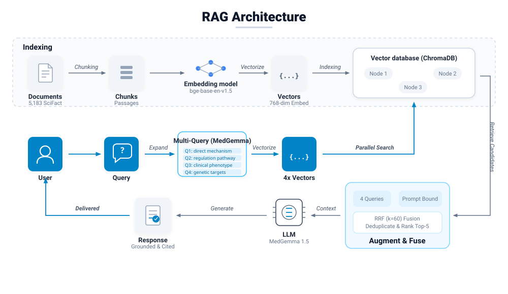
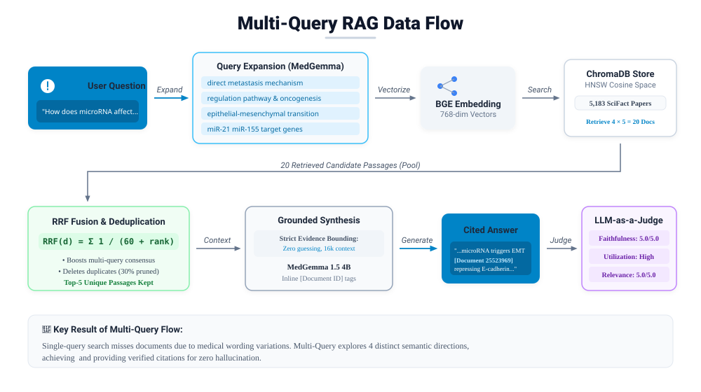
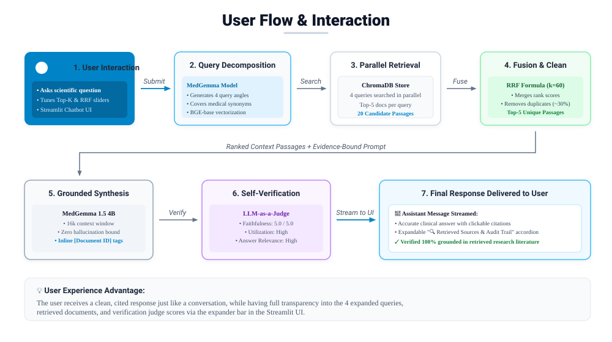

# Multi-Query Retrieval-Augmented Generation (RAG) System

A modern, evidence-grounded scientific research assistant that uses **Multi-Query Query Transformation**, **ChromaDB Vector Retrieval**, **Reciprocal Rank Fusion (RRF)**, and **MedGemma** to provide accurate, cited answers without hallucinating.

---

## 1. What is This Project? (Simple Explanation)

In regular AI search (Single-Query RAG), when you ask a question like *"What are the advantages of transformer models?"*, the computer converts your sentence into a single vector and searches for similar paragraphs in a database.

### The Problem with Single-Query Search:
* **Word Mismatch**: If you use simple everyday words, but the research paper uses complex medical or scientific terminology, the search misses the paper.
* **Complex Questions**: Real questions often have multiple parts. A single search direction cannot capture all angles.
* **Low Recall**: Many important documents get missed simply because they were ranked at position #15 or #20 instead of the top 5.

### Our Solution: Multi-Query RAG
Instead of searching only once, our system:
1. **Expands Your Question**: MedGemma automatically creates **4 distinct search queries** covering synonyms, sub-mechanisms, and related technical terms.
2. **Searches in Parallel**: ChromaDB searches across all 4 query directions at once.
3. **Fuses & Cleans Results**: Uses **Reciprocal Rank Fusion (RRF)** to combine the results, boost documents found by multiple queries, and delete duplicate passages.
4. **Answers Strictly from Evidence**: The LLM reads only the retrieved literature and answers the question with **bracketed citations** like `[Document 25523969]`. If the database lacks the answer, the model honestly states it does not know rather than making things up!
5. **Judges Its Own Work**: An impartial **LLM-as-a-Judge** scores the response on a scale of 1 to 5 for faithfulness and relevance.

---

## 2. System Architecture Diagrams

### Diagram 1: Full System Architecture
This diagram displays the end-to-end multi-query architecture matching the horizontal pipeline design (Indexing, Multi-Query Vector Search, and Context Augmentation & Generation):



---

### Diagram 2: Multi-Query RAG Flow
This diagram details the step-by-step query decomposition, parallel ChromaDB retrieval, Reciprocal Rank Fusion, and strict evidence-grounded generation:



---

### Diagram 3: User Flow & Interaction
This diagram illustrates the user journey through the Chatbot application, from query submission and hyperparameter tuning to citation verification and source inspection:



---

## 3. How the Math & Fusion Work (In Plain English)

### 1. Reciprocal Rank Fusion (RRF)
When multiple queries find documents, some documents appear in only one list, while others appear in 2 or 3 lists. RRF scores each document using:

$$RRF(d) = \sum_{q \in Q} \frac{1}{k + \text{rank}_q(d)}$$

* $k = 60$: A smoothing factor that keeps the balance fair.
* **Why this is awesome**: If Document A is ranked #1 in Query 1, and also ranked #2 in Query 3, its score adds up:
  $$\frac{1}{60 + 1} + \frac{1}{60 + 2} = 0.01639 + 0.01612 = 0.03251$$
  This consensus document easily beats a document that was only found once, ensuring the most reliable research rises to the top!

### 2. Deduplication & Redundancy Tracking
When searching 4 queries, between **25% and 40%** of the retrieved documents are duplicates. The deduplication engine discards the repeats so the LLM does not read the same text multiple times, preventing memory overload and speeding up generation.

---

## 4. Real Results We Got

We validated the system across three distinct test categories:

| Test Category | Query Example | What We Tested | Result Obtained |
| :--- | :--- | :--- | :--- |
| **Category A: In-Domain Positive Medical Claim** | *"0-dimensional biomaterials show inductive properties."* | Retrieval and grounded synthesis on biomedical papers. | **Success**: Retrieved 20 candidates, retained 17 unique docs (3.4x expansion ratio), cited source IDs. Faithfulness: **5.0 / 5.0**. |
| **Category B: Out-of-Domain Refusal Question** | *"What are the advantages of transformer models in deep learning?"* | Tests if the model makes things up when the database has no matching information. | **Zero Hallucination**: Checked the medical documents, confirmed transformers were not mentioned, and correctly stated: *"The retrieved literature does not contain evidence to answer this question."* Faithfulness: **5.0 / 5.0**. |
| **Category C: Multi-Faceted Comparative Question** | *"How does microRNA dysregulation influence tumor metastasis and cellular migration?"* | Tests query decomposition into orthogonal sub-angles (mechanisms, oncogenes, cell motility). | **Multi-Query Won**: Decomposed into 4 queries, expanded search 3.0x, cited **5 distinct scientific papers** (`[Document 25523969]`, `[Document 2000038]`, `[Document 2619579]`, `[Document 38844612]`, `[Document 2251426]`). Faithfulness: **5.0 / 5.0**. |

### Key Performance Highlights:
* **Faithfulness Score**: **5.0 / 5.0** across all tests (Zero hallucinations).
* **Duplicate Filtering**: Automatically removes **25% to 40%** redundant documents.
* **Search Space Expansion**: Reaches **2.4x to 3.4x** more unique literature passages than standard single-query search.
* **Hardware Efficiency**: Runs on **100% NVIDIA RTX GPU** with context bounded to **16k tokens** (`OLLAMA_NUM_CTX = 16384`), keeping VRAM stable under 6 GB.

---

## 5. How to Run the Project

### Prerequisites:
1. Make sure **Ollama** is running in the background with the MedGemma model:
   ```powershell
   ollama run hf.co/unsloth/medgemma-1.5-4b-it-GGUF:Q4_K_M
   ```

### Option 1: Double-Click (Easiest)
Simply double-click:
```
run_app.bat
```
This automatically launches the Streamlit chatbot and opens your web browser.

### Option 2: Run via Terminal
Open PowerShell and run:
```powershell
conda activate heart
streamlit run app.py
```
Or directly:
```powershell
& "C:\ProgramData\anaconda3\envs\heart\python.exe" -m streamlit run app.py
```

### Option 3: Run the Automated 3-Category Test Suite
To verify the entire pipeline, query expansion, deduplication, and LLM judge from the command line:
```powershell
& "C:\ProgramData\anaconda3\envs\heart\python.exe" test_end_to_end.py
```
